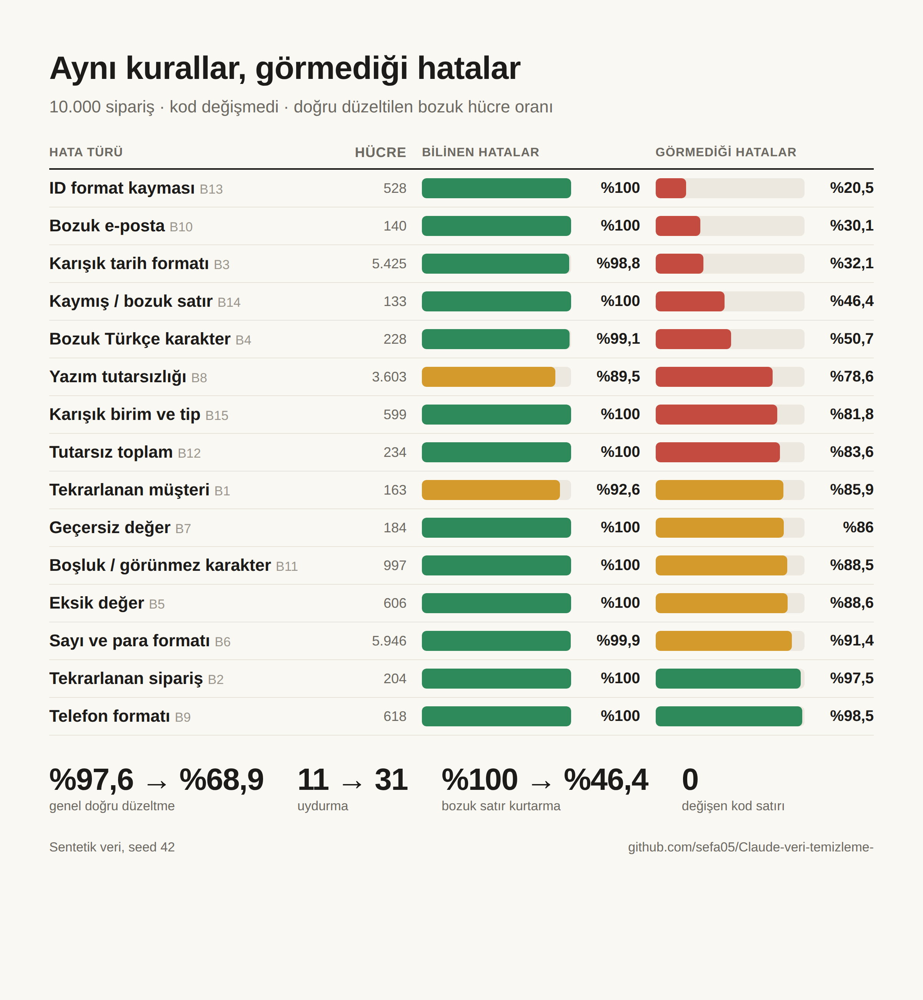

# Kirli Veri Deneyi: Kurallar Ne Kadar Dayanıklı?

Bilerek bozulmuş 10.000 siparişlik bir Türk e-ticaret veri setini LLM kullanmadan, sadece kurallarla temizleyen ve
her düzeltmeyi hücre hücre **ölçen** bir deney. Veri sentetiktir: önce temiz hali üretildi ve saklandı, sonra 15
farklı hata türüyle bozuldu. Temizleme sonucu bu temiz halle karşılaştırılır.

## Özet

| | 1. bölüm: bilinen hatalar | 2. bölüm: görmediği hatalar |
|---|---|---|
| Soru | Kurallar kirli veriyi ne kadar temizler? | Aynı kurallar yeni hata biçimlerinde ne yapar? |
| Doğru düzeltme | **%97,6** | **%68,9** |
| Uydurma (bilinmeyen değere değer yazma) | 11 | 31 |
| Bozuk satır kurtarma | %100 | %46,4 |
| Kaybolan sipariş | 0 | 123 |
| Rapor | [PDF](belgeler/kirli_veri_deneyi_bolum1.pdf) | [PDF](belgeler/kirli_veri_deneyi_bolum2.pdf) |

**Ana bulgular**

1. Kurallar yazıldıkları hatalarda neredeyse kusursuz. Takıldıkları yerler sözlükte olmayan kısaltmalar (`TEX`,
   `Papara`) ve gün/ay sırası belirsiz tarihler (`06/01/1967`).
2. Kod değişmeden hata biçimleri değişince doğruluk %97,6'dan %68,9'a düştü. En sert düşüşler ID biçimi, e-posta ve
   tarihlerde.
3. Kırılma çoğunlukla sessiz: kurtarılabilir hücrelerin %28,3'ü hata ya da uyarı olmadan boş kaldı.
4. Tek bir görünmez `\r` karakteri 72 siparişi kaybettirdi.
5. Genel kurallar (önek eşleşmesi, sadece rakam ayıklama) dayandı, özel kurallar kırıldı.

**Pratik sonuç:** Kural tabanlı bir veri hattında doğruluk kadar boş hücre oranını, karantinaya düşen satır sayısını ve
satır sayısı farkını da izleyin.



## Web sitesi

İki bölüm `site/` klasöründe statik bir site olarak da var: ana sayfa, `/bolum-1` ve `/bolum-2`. Grafikler sayfada
HTML olarak çizilir, mobilde ve karanlık modda çalışır. X'te paylaşılınca görselli önizleme kartı çıkar.

Vercel'e yüklemek için repoyu Vercel'de içe aktarmak yeterli. `vercel.json` çıktı klasörünü (`site`) ve kısa
adresleri ayarlar, derleme adımı yoktur. Siteyi yeniden üretmek için:

```bash
python belgeler/site_uret.py --site-url https://alan-adin.vercel.app
```

## Sen de dene

İki veri seti de açık. Kendi yönteminle (kural, LLM, ajan ya da elle) temizle ve tek komutla puanla:

```bash
pip install -e .
veri-temizle puanla benim_ciktim/                                    # 1. bölüm: bilinen hatalar
veri-temizle puanla benim_ciktim2/ --gercek veri_seti_surpriz/gercek # 2. bölüm: görmediği hatalar
```

Beklenen çıktı biçimi ve kurallar: [veri_seti/README.md](veri_seti/README.md) ·
[veri_seti_surpriz/README.md](veri_seti_surpriz/README.md). Yöntemin iki sette de iyiyse gerçekten genelleşiyor
demektir.

## Okurken bilinmesi gerekenler

- **Hataları da kuralları da aynı kişi yazdı.** 1. bölümdeki %97,6 bu yüzden gerçek hayattakinden iyimser. 2. bölüm
  bu yanlılığı ölçmek için yapıldı: kural kodu `60d97ad` commit'inde donduruldu ve hiç değiştirilmedi.
- **2. bölüm bir stres testidir.** Yeni hata biçimlerini de aynı kişi seçti ve kural kodunu biliyordu. Yalnızca
  gerçek değeri kirli metinden kesin olarak çıkarılabilen biçimler kullanıldı.
- **Doğruluk** kurtarılabilir bozuk hücreler üzerinden hesaplanır. **Uydurma**, gerçeği bilinemeyen ya da gerçekte
  boş olan bir hücreye değer yazmaktır.
- Veri tamamen sentetiktir, gerçek kişilere ait değildir.

## Deney nasıl kuruldu?

**Veri:** 2.500 müşteri, 300 ürün, 10.000 sipariş. Türk ad-soyad listeleri, gerçek il ve ilçeler, kategoriye göre
fiyat aralıkları, hafta sonu ve Kasım yoğunluğu, `toplam = adet × fiyat × (1 − indirim)` gibi iş kuralları.

**Hata türleri:**

| # | Hata | 1. bölüm örnekleri | 2. bölüm örnekleri |
|---|---|---|---|
| B1 | Tekrarlanan müşteri | Aynı kişi yeni ID ile, ad-soyad yer değiştirmiş | aynı |
| B2 | Tekrarlanan sipariş | Aynı satır 2-3 kez | aynı |
| B3 | Karışık tarih | `05/03/2024`, `5 Mart 2024`, `05-Mar-2024` | `27 Şubat 1987 Cuma`, Unix zamanı, Excel numarası |
| B4 | Bozuk Türkçe karakter | `Ä°stanbul`, `Ýstanbul`, `?stanbul` | `Ya&#287;mur`, çift bozulma, `Ba_ak` |
| B5 | Eksik değer | `NULL`, `-`, `yok`, `N/A` | `Belirtilmemiş`, `#N/A`, `(boş)` |
| B6 | Para ve oran | `1.250,50 TL`, `₺1,250.50`, `%10` | `81 TL 62 kr`, `1 250,50 TL`, `yüzde 10` |
| B7 | Geçersiz değer | 1850 doğumlu müşteri, 2038 tarihli sipariş | aynı |
| B8 | Yazım tutarsızlığı | `İST`, `34`, `TEX`, `Papara` | `TY Express`, `Yurtici Krg`, `İstanbul/Sarıyer` |
| B9 | Telefon | `+90(532)1234567` | `(0532) 1234567`, `0532... / cep` |
| B10 | Bozuk e-posta | `ayse@@gmail.com`, `ayse@gmial.com` | `ayse[at]gmail.com`, `mailto:...` |
| B11 | Görünmez karakter | sıfır genişlikli boşluk, sekme | `\r`, yumuşak tire, ince boşluk |
| B12 | Tutarsız toplam | İndirimsiz ya da basamak kaymış toplam | aynı |
| B13 | ID kayması | `M367`, `m-00367`, `#367` | `MUS-00211`, `0000834`, `M00367.0` |
| B14 | Bozuk satır | `;` ayraç, fazladan alan, yapışık satır | sekme ya da `\|` ayraç, sonda fazladan virgül |
| B15 | Karışık birim | `3 adet`, `üç`, `3,0` | `3 pcs`, `2 (iki)`, `bir tane` |

**Kural yöntemi:** Satır onarımı, Türkçe karakter onarımı, tarih, para ve telefon çözümleyicileri, il ve kategori
için bulanık eşleştirme, `toplam = adet × fiyat × (1 − indirim)` ile türetme ve müşteri tekrarı birleştirme. Kural
güvenle çözemediği değeri tahmin etmez, boş bırakır.

## Kurulum ve komutlar

```bash
pip install -e ".[test]"
veri-temizle deney --yontem kural           # 1. bölümü baştan üret, temizle, ölç, rapor (calisma/rapor.html)
veri-temizle uret --seed 42 --surpriz       # 2. bölümün verisini üret
veri-temizle puanla <klasör>                # Temiz bir çıktıyı gerçek doğruyla puanla
veri-temizle gorsel                         # Paylaşım görseli (PNG, Chromium gerekir)
python belgeler/pdf_uret.py                 # 1. bölüm PDF'i
python belgeler/bolum2_uret.py              # 2. bölüm görselleri ve PDF'i
python -m pytest                            # Testler
```

Tüm rakamlar `ornek_sonuc/` altındaki sonuç dosyalarından okunur. Aynı seed her seferinde birebir aynı veriyi üretir.

## Dosyalar

```
belgeler/             1. ve 2. bölüm PDF'leri, site ve bunları üreten betikler
site/                 Vercel'e yüklenen statik site (üretilmiş dosyalar)
gorseller/            X için paylaşım görselleri
veri_seti/            1. bölüm: kirli veri + cevap anahtarı
veri_seti_surpriz/    2. bölüm: kirli veri + cevap anahtarı
ornek_sonuc/          Kural yönteminin ölçüm sonuçları ve HTML raporları
veri_temizleme/
  uretici/            temiz veri, bozma motoru (B1-B15), sürpriz biçimler
  temizleme/          kural yöntemi (2. bölümde dondurulmuş)
  olcum.py            gerçek doğruyla hücre bazlı ölçüm
  llm/                LLM ve hibrit yöntemler (hazır, çalıştırılmadı)
  cli.py, deney.py, rapor.py, gorsel.py
tests/
```

## Ek: LLM ve hibrit yöntemler

Kodda iki yöntem daha hazır ama **API anahtarı olmadığı için çalıştırılmadı**, bu yüzden sonuç yok:
- **Sadece LLM:** Ham CSV satırları gruplar halinde Claude'a gider, model temiz kaydı JSON şemasıyla döner.
- **Hibrit:** Kural önce çalışır, çözemediği hücreler LLM'e sorulur. İl ve seçenekli sütunlarda model referans
  listeden çekilen adaylar arasından seçer.

`ANTHROPIC_API_KEY` tanımlıyken `veri-temizle deney` üç yöntemi aynı veride karşılaştırır. `veri-temizle maliyet`
çalıştırmadan önce kaba maliyet tahmini verir. Varsayılan modelle, 1.000 siparişlik örneklem için yaklaşık $8 (düşünme
tokenları hariç).
