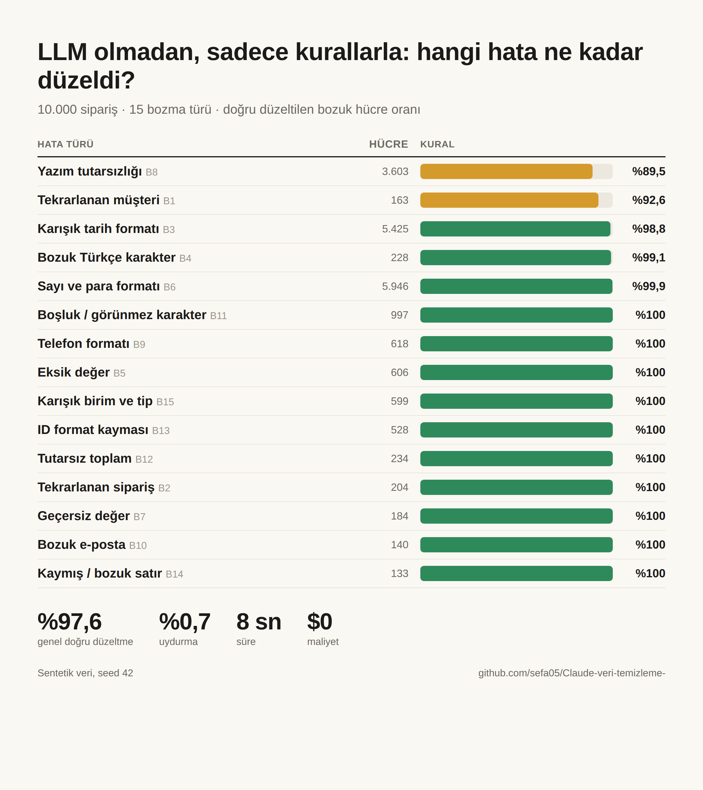
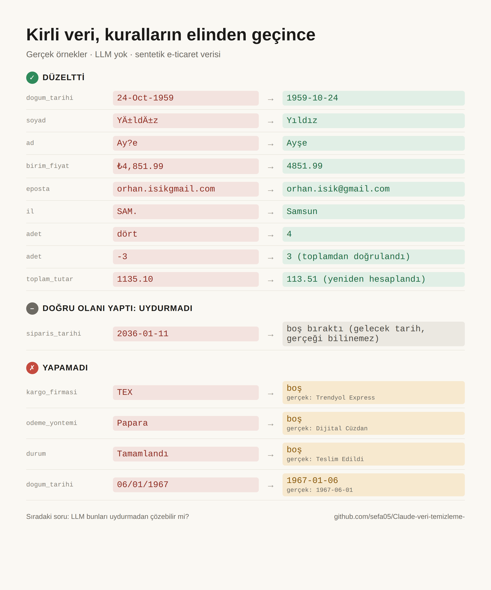

# Kirli Veri Temizleme: Kural mı, LLM mi, Hibrit mi?

Dağınık ve bozuk e-ticaret verisini üç farklı yöntemle temizleyip hangisinin gerçekten çalıştığını **ölçen** bir
deney düzeneği. Veri sentetiktir. Üretici önce temiz veriyi oluşturur, sonra 15 farklı yolla bozar ve her bozmayı
kaydeder. Temizleme sonucu bu gerçek doğruyla hücre hücre karşılaştırılır.

| Yöntem | Nasıl çalışır |
|---|---|
| **Kural** | pandas + elle yazılmış kurallar + bulanık eşleştirme. LLM çağrısı yok |
| **Sadece LLM** | Ham CSV satırları 20-25'lik gruplar halinde Claude'a gider, model temiz kaydı JSON şemasıyla döner |
| **Hibrit** | Kurallar önce çalışır. Yalnızca kuralın çözemediği hücreler ve belirsiz müşteri çiftleri LLM'e gider. İl ve seçenekli sütunlarda model, referans listeden çekilen adaylar arasından seçer (RAG) |

Her yöntem şu eksenlerde ölçülür: **doğruluk** (bozma türü başına), **uydurma** (kurtarılamaz ya da gerçekte boş
bir hücreye değer yazma), **temiz hücreyi bozma**, **müşteri eşleştirme F1**, **maliyet** ve **süre**.

## Kurulum

```bash
pip install -e ".[test]"
export ANTHROPIC_API_KEY=...   # Sadece LLM ve hibrit yöntemler için
```

## Kullanım

```bash
veri-temizle deney                          # Üret + üç yöntemle temizle + ölç + rapor (calisma/rapor.html)
veri-temizle deney --yontem kural           # API anahtarı olmadan sadece kural yöntemi
veri-temizle maliyet                        # LLM yönteminin kaba maliyet tahmini (önce `uret` veya `deney`)
veri-temizle deney --model claude-sonnet-5 --effort low --orneklem 500
veri-temizle uret --satir 10000 --seed 42 --oran-carpani 1.5   # Daha sert bozma
veri-temizle rapor                          # sonuclar.json'dan raporu yeniden üret
veri-temizle gorsel                         # Paylaşım için tablo görseli (PNG, Chromium gerekir)
veri-temizle puanla benim_ciktim/           # Kendi temizlediğin veriyi puanla
```

Varsayılan model `claude-opus-5`. Sadece LLM yöntemi tüm müşteri ve ürünleri, siparişlerden ise **1.000 satırlık
sabit bir örneklemi** temizler (10 bin sipariş için yaklaşık $33, örneklem için yaklaşık $8 tahmin, düşünme tokenları
hariç). Karşılaştırma tablosu üç yöntemi de aynı kapsamda ölçer. LLM cevapları `calisma/llm_onbellek/` altında
saklanır: aynı deney ikinci kez ücretsiz ve birebir aynı sonuçla çalışır. İstekler, model bir isteği güvenlik
gerekçesiyle reddederse sunucu tarafında uygun modele geçen `fallbacks: "default"` ayarıyla gönderilir. Kapatmak için
`--geri-donus-yok` kullanılır.

## Çıktılar

```
calisma/
  veri/kirli/          musteriler.csv, urunler.csv, siparisler.csv   (temizleyicilerin gördüğü tek şey)
  veri/gercek/         temiz veri, bozma_kaydi.csv, tekrar_eslesme.csv (yalnızca ölçümde kullanılır)
  cikti/<yontem>/
    temiz/             temiz CSV'ler, veri.xlsx, musteri_eslesme.csv
    sorunlar.csv       hücre bazlı: ham değer, temiz değer, yapılan işlem
    karantina.csv      okunamayan satırlar
    hatalar.csv        gerçek doğruyla uyuşmayan hücreler
  sonuclar.json
  rapor.html           Türkçe karşılaştırma raporu
```

## Bozma kataloğu

| # | Bozma | Örnek |
|---|---|---|
| B1 | Tekrarlanan müşteri | Aynı kişi yeni ID ile, ad-soyad yer değiştirmiş, farklı e-posta. Siparişlerinin bir kısmı yeni kayda bağlı |
| B2 | Tekrarlanan sipariş satırı | Aynı satır 2-3 kez |
| B3 | Karışık tarih | `05/03/2024`, `5 Mart 2024`, `20240305`, `05-Mar-2024`, ABD biçimi `03/05/2024` |
| B4 | Bozuk Türkçe karakter | `Ä°stanbul`, `Ýstanbul`, `?stanbul` |
| B5 | Eksik değer | boş, `NULL`, `-`, `yok`, `N/A`, `0000-00-00` |
| B6 | Para ve oran formatı | `1.250,50 TL`, `₺1,250.50`, `%10`, `0,10` |
| B7 | Geçersiz değer | 1850 doğumlu müşteri, 2038 tarihli sipariş, `adet = 9999`, teslimden önce sipariş |
| B8 | Yazım tutarsızlığı | `İST`, `34`, `Ev&Yasam`, `TEX`, `Papara`, `Tamamlandı` |
| B9 | Telefon formatı | `+90(532)1234567`, `532-123-4567` |
| B10 | Bozuk e-posta | `ayse@@gmail.com`, `ayse@gmial.com`, `ayse@gmail,com` |
| B11 | Boşluk ve görünmez karakter | sıfır genişlikli boşluk, bölünmez boşluk, sekme |
| B12 | Tutarsız toplam | İndirim uygulanmamış ya da basamak kaymış toplam |
| B13 | ID kayması | `M367`, `m-00367`, `#367` |
| B14 | Bozuk satır | `;` ayraçlı satır, fazladan alan, iki satır yapışmış |
| B15 | Karışık birim | `3 adet`, `üç`, `3,0` |

## İlk sonuç: kural yöntemi (10.000 sipariş, seed 42)

Tüm sonuçlar tek dosyada: **[Kirli veri deneyi, 1. bölüm (PDF)](belgeler/kirli_veri_deneyi_bolum1.pdf)**



| Metrik | Sonuç |
|---|---|
| Kurtarılabilir bozuk hücrelerde doğru düzeltme | **%97,6** (19.271 hücre) |
| Uydurma | 11 / 1.617 (%0,7) |
| Temiz hücreyi bozma | %0 |
| Müşteri eşleştirme F1 | 0,990 (159 çiftten 156'sı bulundu, yanlış eşleşme yok) |
| Tekrar sipariş silme / bozuk satır kurtarma | %100 / %100 |
| Süre | ~8 sn |

Kuralın takıldığı yerler: sözlükte olmayan eş anlamlılar (`TEX`, `YK`, `Papara`, `Tamamlandı`: B8'de %89,5),
gün/ay sırası belirsiz tarihler (`06/01/1967`) ve kanıtı zayıf müşteri çiftleri. LLM ve hibrit sonuçları API
anahtarıyla `veri-temizle deney` çalıştırılınca rapora eklenir.



## Veri seti: sen de dene

`veri_seti/` klasöründe kirli veri ve cevap anahtarı var. Kendi yönteminle temizle, `veri-temizle puanla
benim_ciktim/` ile skorunu al. Ayrıntılar: [veri_seti/README.md](veri_seti/README.md).

## Okurken bilinmesi gerekenler

- **Kural yöntemi avantajlı başlıyor.** Bozma kataloğunu ve kuralları aynı kişi yazdı. Gerçek hayatta kural yazarı
  hataların hepsini önceden görmez. Kural yöntemindeki eş anlamlı listesi kasıtlı olarak kısa tutuldu ve
  `veri_temizleme/temizleme/sozluk.py` içinde açıkça görülebilir.
- LLM ve hibrit yöntemlere bozma kataloğu gösterilmez. Üç yöntem de aynı iş kurallarını (veri çekim tarihi,
  teslim süresi, toplam formülü) ve aynı referans listeleri (81 il, kategoriler, kargo firmaları) alır.
- Müşteri tekrarlarında adaylar her yöntemde aynı şekilde ad-soyad ile gruplanır. Kararı kural yönteminde puanlama,
  LLM yönteminde model verir.
- Maliyet liste fiyatıyla token kullanımından hesaplanır.

## Proje yapısı

```
veri_temizleme/
  referans.py            iller, ilçeler, adlar, kategoriler, tablo şemaları
  metin.py               Türkçe büyük/küçük harf, mojibake onarımı
  uretici/               temiz.py (gerçek doğru), bozma.py (B1-B15 + kayıt)
  temizleme/             okuma.py (satır onarımı), cozumleyiciler.py, sozluk.py, kural.py
  llm/                   istemci.py (önbellek + maliyet), yontem.py (sadece LLM), hibrit.py
  olcum.py               gerçek doğruyla karşılaştırma
  deney.py, rapor.py, cli.py
tests/                   pytest (LLM testleri sahte istemciyle, API çağrısı yapmaz)
```
